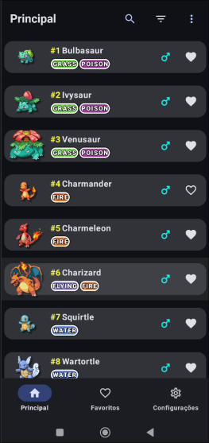

# PokeDex App

Aplicativo de PokéDex construído em Kotlin usando Jetpack Compose e [PokéAPI](https://github.com/PokeAPI/pokeapi)!

Feito com o objetivo de estudar desenvovimento Android, arquitetura MVVM, Paging 3, e integração com Room para cache local.

# Imagens



# Funcionalidades
- Listagem de Pokémons paginada utilizando Paging 3
- Exibição de detalhes do Pokémon, incluindo tipos e estatísticas
- Armazenamento em cache utilizando Room para carregamento offline
- Navegação entre telas com Type Safe Navigation
- Interface construída inteiramente com Jetpack Compose

# Pré-requisitos
- Android Studio Koala
- JDK 11 ou superior
- Conexão com a internet para consumir a PokéApi inicialmente

# Como Rodar o Projeto
1. Clone o repositório:
```bash
git clone https://github.com/UmBarril/PokeDexApp.git
```

2. Abra o projeto no Android Studio
Abra o Android Studio, selecione File > Open, e navegue até o diretório do projeto clonado.

3. Sincronize os pacote
Vá na aba direita do Gradle e sincronize os pacotes

4. Compilar o projeto
No Android Studio, clique em Build > Make Project ou pressione Ctrl + F9.

# Melhorias futuras
- Permitir filtragem de multiplos tipos
- Vários temas
- Gráfico de stats de pokémon com um Radar Chart
